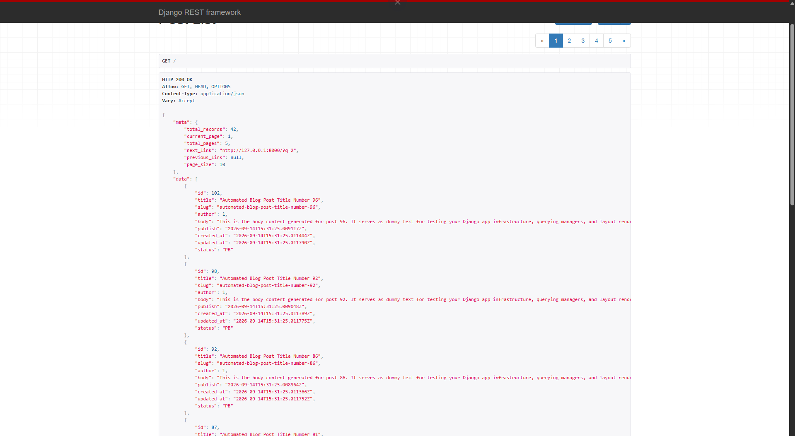
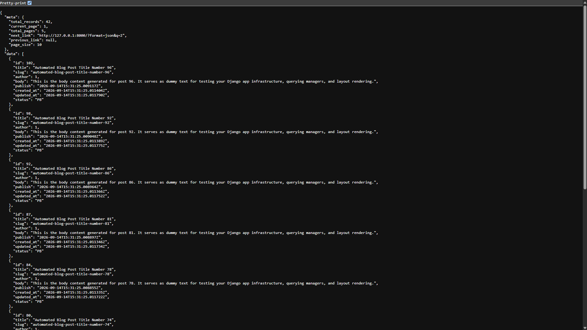
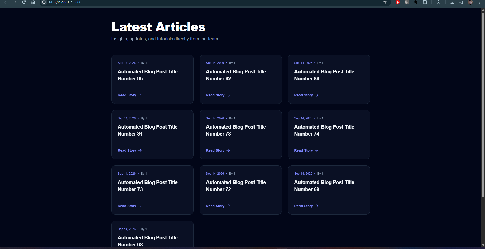
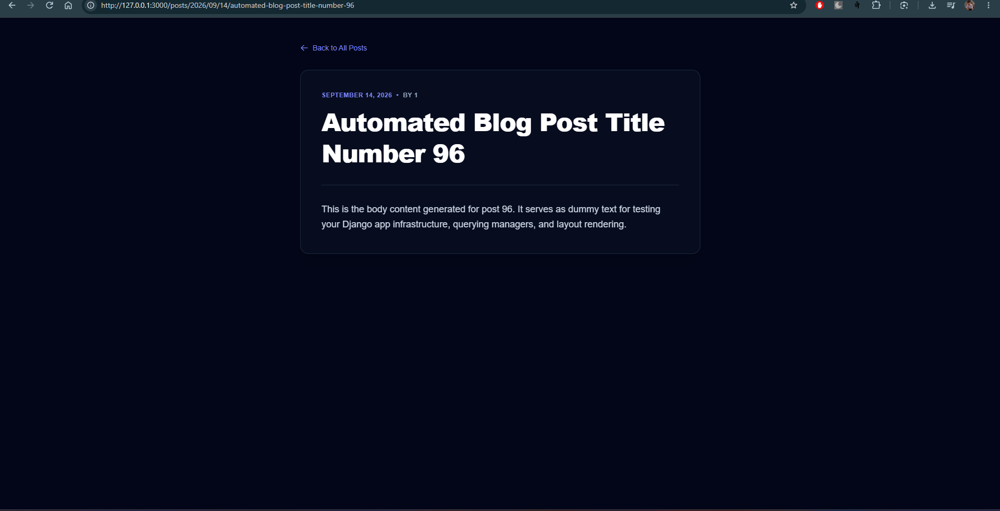

# Django + Next.js Blog Platform

A full-stack blog platform built with **Django REST Framework** as the backend API and **Next.js** as the frontend.

The project demonstrates how a Django application can expose blog content through a REST API while a modern Next.js frontend consumes that API and renders both the blog listing and individual blog posts.

## 📸 Screenshots

| Django REST Framework — Browsable API | Backend API — Pretty-printed JSON |
|---|---|
|  |  |

| Frontend — List View | Frontend — Detail View |
|---|---|
|  |  |

## 🚀 Tech Stack

### Backend

- Python
- Django 6.1
- Django REST Framework
- SQLite
- Django ORM

### Frontend

- Next.js 16
- React 19
- TypeScript
- Tailwind CSS 4

---

## 📌 Features

- Create and manage blog posts through Django Admin
- Draft and Published post status
- Published-post filtering
- Date-based blog URLs
- Unique slugs for posts on a particular publishing date
- REST API using Django REST Framework
- Custom API pagination
- Next.js App Router
- Dynamic routes for individual posts
- Server-side data fetching in Next.js
- Incremental revalidation of API data
- Responsive dark-themed UI
- 404-style handling when a requested post does not exist

---

## 🏗️ Architecture

The application is split into two separate parts:

```text
blog-platform/
│
├── backend/
│   ├── blog/
│   │   ├── models.py
│   │   ├── serializers.py
│   │   ├── views.py
│   │   ├── urls.py
│   │   ├── pagination.py
│   │   └── migrations/
│   │
│   └── mysite/
│       ├── settings.py
│       ├── urls.py
│       ├── asgi.py
│       └── wsgi.py
│
└── frontend/
    └── blog_platform/
        └── app/
            ├── layout.tsx
            ├── page.tsx
            ├── globals.css
            │
            └── posts/
                └── [year]/
                    └── [month]/
                        └── [day]/
                            └── [slug]/
                                └── page.tsx
```

### How the two applications communicate

```text
                 HTTP Request
                      │
                      ▼
              ┌───────────────┐
              │    Next.js    │
              │   Frontend    │
              └───────┬───────┘
                      │
                      │ fetch()
                      ▼
              ┌───────────────┐
              │ Django REST   │
              │      API      │
              └───────┬───────┘
                      │
                      ▼
              ┌───────────────┐
              │ Django ORM /  │
              │    Database   │
              └───────────────┘
```

The frontend does not directly access the database. Instead:

**Next.js → Django API → Database**

This separation allows the same Django API to potentially serve other clients such as mobile applications or another frontend.

---

# 🔙 Backend — Django

The backend contains the blog data model, REST API, pagination, and Django Admin functionality.

## Post Model

The main model is `Post`.

It contains:

| Field | Description |
|---|---|
| `id` | Automatically generated primary key |
| `title` | Blog post title |
| `slug` | URL-friendly identifier |
| `author` | Foreign key to the Django user model |
| `body` | Blog post content |
| `publish` | Publication date/time |
| `created_at` | Automatically recorded creation time |
| `updated_at` | Automatically updated modification time |
| `status` | Draft or Published |

### Post Status

Posts can have two statuses:

```text
DF → Draft
PB → Published
```

Only published posts are exposed through the public API.

The project also defines a custom `PublishedManager`:

```python
class PublishedManager(models.Manager):
    def get_queryset(self):
        return (
            super().get_queryset().filter(
                status=Post.Status.PUBLISHED
            )
        )
```

This allows published posts to be queried with:

```python
Post.published.all()
```

The current list API explicitly uses:

```python
Post.objects.filter(status=Post.Status.PUBLISHED)
```

---

# 🔌 REST API

The Django backend uses Django REST Framework's generic API views.

## List Posts

```http
GET /
```

The root URL is connected to the blog application's URL configuration.

The endpoint returns published posts with pagination.

Example:

```http
GET /
```

The API response follows this structure:

```json
{
  "meta": {
    "total_records": 25,
    "current_page": 1,
    "total_pages": 3,
    "next_link": "...",
    "previous_link": null,
    "page_size": 10
  },
  "data": [
    {
      "id": 1,
      "title": "My First Post",
      "slug": "my-first-post",
      "author": 1,
      "body": "Post content...",
      "publish": "2026-09-15T10:00:00Z",
      "created_at": "2026-09-15T09:00:00Z",
      "updated_at": "2026-09-15T09:30:00Z",
      "status": "PB"
    }
  ]
}
```

---

## Post Detail

Individual posts use a date-based URL:

```http
GET /posts/<year>/<month>/<day>/<slug>/
```

For example:

```text
/posts/2026/09/15/my-first-post/
```

The backend searches for a post using:

```text
publish year
publish month
publish day
slug
```

This means the requested URL must match the post's publication date and slug.

---

# 📄 API Pagination

The project implements a custom `PageNumberPagination`.

Default page size:

```text
10 posts
```

The API supports custom page size using:

```text
size
```

and uses:

```text
q
```

as the page query parameter.

For example:

```http
GET /?q=2
```

requests page 2.

To request five posts per page:

```http
GET /?q=2&size=5
```

The maximum page size is:

```text
100
```

### Pagination response

Pagination metadata is returned under `meta`:

```json
{
  "meta": {
    "total_records": 50,
    "current_page": 2,
    "total_pages": 5,
    "next_link": "...",
    "previous_link": "...",
    "page_size": 10
  },
  "data": []
}
```

---

# 🎨 Frontend — Next.js

The frontend uses the **Next.js App Router**.

## Blog Listing

The homepage is:

```text
/
```

The page fetches the Django API using:

```typescript
fetch(process.env.NEXT_PUBLIC_API)
```

The response's `data` property is used to render the blog posts.

Each post is displayed as a responsive card containing:

- Publication date
- Author
- Title
- Link to the full article

---

# 🔗 Dynamic Blog URLs

Next.js uses dynamic route segments:

```text
app/posts/[year]/[month]/[day]/[slug]/page.tsx
```

This creates URLs such as:

```text
/posts/2026/09/15/my-first-post
```

The values are passed to the page as:

```text
year
month
day
slug
```

The frontend then constructs the corresponding Django API URL:

```text
/posts/2026/09/15/my-first-post/
```

So the frontend and backend use the same URL structure.

```text
Next.js URL
    │
    ▼
/posts/2026/09/15/my-first-post
    │
    │ fetch()
    ▼
Django API
    │
    ▼
/posts/2026/09/15/my-first-post/
```

---

# ⚡ Data Revalidation

The frontend fetches API data with:

```typescript
{
  next: {
    revalidate: 6
  }
}
```

This tells Next.js to revalidate the fetched data after the specified interval rather than treating it as permanently static.

Both the blog listing and detail page use this approach.

---

# 🛠️ Installation

## 1. Clone the repository

```bash
git clone <your-repository-url>
cd <project-directory>
```

---

# Backend Setup

Move into the backend:

```bash
cd backend
```

Create a virtual environment:

### Windows

```powershell
python -m venv .venv
```

Activate it:

```powershell
.venv\Scripts\Activate.ps1
```

Install dependencies:

```bash
pip install django djangorestframework
```

Run migrations:

```bash
python manage.py migrate
```

Create an admin user:

```bash
python manage.py createsuperuser
```

Start the Django development server:

```bash
python manage.py runserver
```

The backend will normally be available at:

```text
http://127.0.0.1:8000/
```

Django Admin:

```text
http://127.0.0.1:8000/admin/
```

---

# Frontend Setup

Open another terminal and move into the frontend:

```bash
cd frontend/blog_platform
```

Install dependencies:

```bash
npm install
```

Create a `.env.local` file:

```env
NEXT_PUBLIC_API=http://127.0.0.1:8000/
```

Start the development server:

```bash
npm run dev
```

The Next.js application will normally be available at:

```text
http://localhost:3000
```

---

# 🔐 Environment Variables

The frontend expects:

```env
NEXT_PUBLIC_API=<Django API URL>
```

Example:

```env
NEXT_PUBLIC_API=http://127.0.0.1:8000/
```

Do not commit private environment variables or secrets to Git.

---

# 🧪 Development Commands

## Django

Run development server:

```bash
python manage.py runserver
```

Create migrations:

```bash
python manage.py makemigrations
```

Apply migrations:

```bash
python manage.py migrate
```

Run tests:

```bash
python manage.py test
```

## Next.js

Start development server:

```bash
npm run dev
```

Build production application:

```bash
npm run build
```

Start production server:

```bash
npm run start
```

Run ESLint:

```bash
npm run lint
```

---

# 📁 Important Files

### Backend

**`blog/models.py`**
Defines the blog post model, status choices, published manager, ordering, and database index.

**`blog/serializers.py`**
Converts `Post` model instances into JSON representations for the REST API.

**`blog/views.py`**
Contains:
- `PostListView`
- `PostDetailView`

**`blog/urls.py`**
Defines the blog API routes.

**`blog/pagination.py`**
Contains the custom pagination implementation and response format.

**`mysite/urls.py`**
Includes the blog URL configuration and Django Admin.

### Frontend

**`app/page.tsx`**
Displays the list of published blog posts.

**`app/posts/[year]/[month]/[day]/[slug]/page.tsx`**
Displays an individual blog post using Next.js dynamic routing.

**`app/layout.tsx`**
Defines the root layout, fonts, and global application metadata.

**`app/globals.css`**
Contains global styles.

---

# 📚 What This Project Demonstrates

This project was built to understand the connection between a Django backend and a modern JavaScript frontend.

The main concepts demonstrated are:

- Django models
- Django ORM
- Custom model managers
- Model relationships
- Django Admin
- Django REST Framework
- Model serializers
- Generic API views
- REST API design
- Custom pagination
- Query parameters
- Dynamic URL routing
- Next.js App Router
- Dynamic route segments
- Server-side data fetching
- API integration
- Data revalidation
- TypeScript
- Tailwind CSS
- Full-stack application architecture

---

# 🔮 Future Improvements

Potential improvements include:

- Add API authentication
- Add user registration and login
- Add author profiles
- Add comments
- Add likes/bookmarks
- Add search
- Add category and tag filtering
- Add frontend pagination controls
- Add post creation/editing UI
- Add Markdown or rich-text rendering
- Add proper TypeScript interfaces instead of `any`
- Add API documentation with OpenAPI/Swagger
- Add automated tests for API endpoints
- Add production deployment configuration
- Add SEO metadata for individual posts

---

# 👨‍💻 Author

**Hem Khatri**

Full-stack web development project focused on learning and applying:

**Django + Django REST Framework + Next.js + TypeScript**

---

## ⭐ Project Goal

The goal of this project is to understand how a **Django REST API can act as the backend of a modern Next.js application**, rather than rendering the entire website directly through Django templates.

It provides a foundation that can later be extended into a larger production-ready blogging platform.
